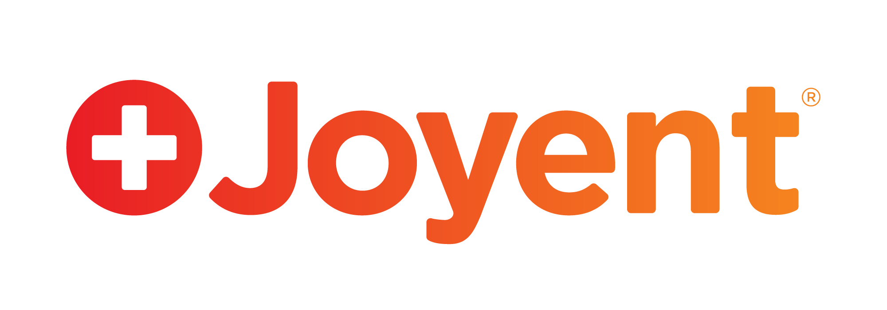
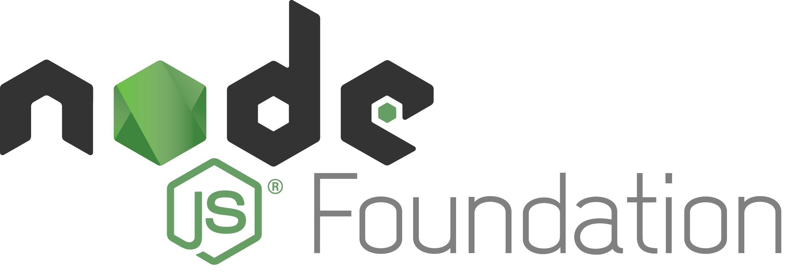
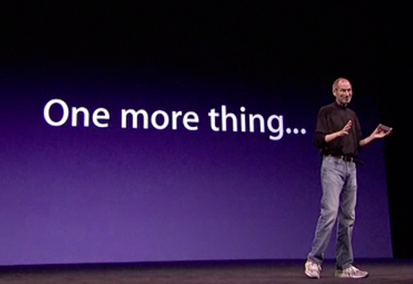
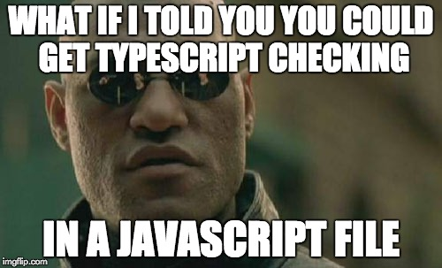

# Node.js for Java Developers
<i class="fab fa-twitter"></i>Gangstead

<!-- .element: class="foot" --> JavaMUG 10/10/2018 *slides https://gangstead.github.io/jode-for-nava*
----
- Citations in the notes, press 'S' to enter speaker view and see them.
====
# Outline
- About me
- JS a very brief history
- Node.js even briefer history
- Node.js overview
- Tooling side by side
- When to use and when to avoid Node

====
# Bio
----
<!-- .element: class="bio-logo" -->
<!-- .element: class="fragment bio-logo" data-fragment-index="1" -->
<!-- .element: class="fragment bio-logo" data-fragment-index="2" -->
<!-- .element: class="fragment bio-logo" data-fragment-index="3" -->
<!-- .element: class="fragment bio-logo" data-fragment-index="4" -->
----
## <!-- .element class="heading-logo" --> Code's Cool Dallas

- Hands-on coding workshops
- <!-- .element: class="fragment" data-fragment-index="1" --> Formerly Nodeschool Dallas, now Node & more
- <!-- .element: class="fragment" data-fragment-index="2" --> Started Jan 2015, 40 past events
- <!-- .element: class="fragment" data-fragment-index="3" --> [meetup.com/CodesCool-Dallas](https://www.meetup.com/CodesCool-Dallas/)

====
# JS History
----
JavaScript, like Java, right?
----
### Netscape _Mocha_<!-- .element: class="highlight" --> project
- Brendan Eich at Netscape wanted to bring _Scheme_<!-- .element: class="highlight" --> and _Self_<!-- .element: class="highlight" --> to the startup Netscape
- Netscape teamed up with Sun Microsystems to bring their *interactive TV language* to the browser
- He built _Mocha_ in May 1995. It was released in September 1995 as _LiveScript_
  - <!-- .element: class="fragment foot highlight" data-fragment-index="1" --> I mean started and finished in 10 days in May 1995
  - <!-- .element: class="fragment foot highlight" data-fragment-index="1" --> Java project started in June 1991, Java 1.0 released January 1996.
Note: Marc Andreessen, of a17z wanted a "glue language" for the browser that was easy to use and could be embedded directly in the markup.  That's why the talks with Sun pivoted from Java in the browser back to a scripting language that could "complement" Java. So Eich's planned language was given a Java-like syntax.
----
<!-- .element: class="text-left" -->
- Some excerpts about _Scheme_<!-- .element: class="highlight" -->

> …a programming language that supports multiple paradigms, including functional programming and imperative programming,[1] and is one of the two main dialects of Lisp. Unlike Common Lisp, the other main dialect, Scheme follows a minimalist design philosophy specifying a small standard core with powerful tools for language extension…<!-- .element: class="foot" -->

- And _Self_<!-- .element: class="highlight" -->

> … an object-oriented programming language based on the concept of prototypes. Self began as a dialect of Smalltalk, being dynamically typed and using just-in-time compilation (JIT) …<!-- .element: class="foot" -->
----
## So why team up with <!-- .element class="heading-logo" -->?
- In one year of being released Netscape had about 75% share of browser market
- Microsoft said "that's a nice market you have there, it'd be a shame if something were to happen to it"
Note: Netscape wanted JS to be the companion language to Java like Visual Basic was to C++

----
## Standardization
- August 1996 - Microsoft included a reverse engineered `JScript` in Internet Explorer 3
- November 1996 - Netscape submits JavaScript standard to ECMA International
  - All browsers can now implement the same language, which they promptly do.  The end.
----
## JS engines
- SpiderMonkey - Netscape and now FireFox. Written by Brendon Eich. Maintained by Mozilla C/C++
- Rhino - developed by original Netscape team in Java for Java. Compiled & Interpreted mode.  Maintained by Mozilla
- Nashorn - replacement for Rhino Java ≥ 1.8
- Chakra - engine for IE 9 + and Edge. C++
Note: IE < 9 had a JS interpreter JScript but Chakra compiles to machine code like all the other engines.
----
## JS engines
- <!-- .element style="height:2em" --> <!-- .element style="height:2em" --> JavaScriptCore/SquirelFish - webkit's JS engine, from KDE project. C++
- <!-- .element style="height:2em" -->V8 .  For Chrome browser but intended to be used as a stand alone project. Since 2017 Node is one of the targets of V8 and included in tests. *Don't Break Node* C++

====
# Node.js history
----
- 1996 
- LiveWire component of NES was a compiled JS environment used to access DB resources kind of like PHP in special tags in the html files
- Also 1996 IIS jscript for ASP and .NET pages
Note: http://philip.greenspun.com/wtr/livewire.html
----
- Mid 2000's
- September 2008 Google releases Chrome browser with JS engine V8 that has greater performance than all other browsers
----
<!-- .element style="height:3em"-->
- Ryan Dahl, employee at software & services firm Joyent makes first Node commits
- Combine Chrome's V8 js engine with an event loop and some IO libraries (http, file, etc)
- First release May 2009.
- September 2009 Isaac Schlueter proposes npm…
----
<!-- .slide: data-background-image="images/npm_package_delivery.png" data-background-size="contain"-->
----
- 2012 Ryan Dahl steps away from Node
- 2015 IO.js fork and spoon lead to formation of Node Foundation
- Joyent's bumbling stewardship comes to an end
<!-- .element style="height:3em"-->
----
<!-- .element style="height:3em"-->
- 2016 Typescript 2.0 and Visual Studio Code GA released
- Both are Microsoft projects had been around for years but this was when they were really ready for wide adoption
----
#### Node.js is JavaScript
and npm is the package manager for the web (3 Billion downloads/week)
- npm used for front and back end dependencies
- 10/4/18 Node + JS Foundations announce [intent to merge](https://blog.npmjs.org/post/178734613655/node-js-foundation)
Note: https://flaviocopes.com/node-history/  JS Foundation formerly called J Query Foundation and houses tons of JS projects like Grunt, JerryScript, ESLint, Lodash, Mocha, Moment, Webpack.
====
# Node.js overview
----
- V8
- Single threaded event loop
- IO libraries
- package manager
- <!-- .element: class="fragment" data-fragment-index="1" -->
----
<!-- .slide: data-background-image="images/nodejs-event-loop.png" data-background-color="white" data-background-size="contain"-->
But hey it's supposed to be single threaded<!-- .element: class="blocking-text fragment" data-fragment-index="1" -->
----
<!-- .slide: data-background-image="images/Event_Loop_in_Node.js.png" data-background-color="white" data-background-size="contain"-->
----
<!-- .element class="strong-contrast" -->
- Assertion Testing, Async Hooks, Buffer, C++ Addons, C/C++ Addons - N-API, Child Processes
- Cluster, Command Line Options, **Console**, Crypto, Debugger, Deprecated APIs, **DNS**, **Domain**, ECMAScript Modules, Errors, Events
- **File System**, Globals, **HTTP**, **HTTP/2**, **HTTPS**, Inspector, Internationalization, Modules, Net
- OS, **Path**, Performance Hooks, **Process**, Punycode, **Query Strings**, **Readline**, REPL, **Stream**
- String Decoder, Timers, **TLS/SSL**, Tracing, **TTY**, **UDP/Datagram**, **URL**, Utilities, V8, VM, ZLIB
Note: https://nodejs.org/dist/latest-v8.x/docs/api/
----
### npm
- command line tool
- also the registry of packages
  - free public packages
    - top level and namespaced
  - paid private
    - private packages or self hosted
  - alternative CLIs use same registry (yarn)
- private company, but distributed with node
Note: it's kind of weird since Node.js is run by the foundation but npm, inc is for-profit
----
<!-- .element class="inline-code-contrast" -->
# Duct tape
- All your regular JS [built in objects](https://developer.mozilla.org/en-US/docs/Web/JavaScript/Reference/Global_Objects) plus `modules`, `exports`, `require`, `console`, [and more](https://nodejs.org/api/globals.html)
- REPL
- inspector (Chrome developer tools for Node.js)
====
# Tooling side by side
----
## starting a program
```
> javac worldstar.java
> java worldstar.class
> node worldstar.js
```
----
## environment variables
```java
System.getenv("FOO");
```
```js
process.env.FOO;  process.env['FOO'];
```
----
## Command line arguments
```java
public static void main(String[] args) {
  System.out.println(args);
}
```
```js
console.log(process.argv);
```
----
## Import vs require
```java
  // in src/main/java/org/springframework/samples/mvc/convert/JavaBean.java
  import java.util.Date;
  import java.util.List;
  import java.util.Map;
  import org.springframework.format.annotation.DateTimeFormat;
```
```js
  // in lib/utils/convert.js
  const moment = require('moment');
  import { flatMap, max, has } from 'lodash'; //es modules
```

Note: Not making this file name up: https://github.com/spring-projects/spring-mvc-showcase/blob/master/src/main/java/org/springframework/samples/mvc/convert/JavaBean.java
----
npm vs maven
- package.json vs pom.xml
```xml
…
<dependency>
  <groupId>org.glassfish</groupId>
  <artifactId>javax.el</artifactId>
  <version>3.0.1-b08</version>
</dependency>
…
```
```json
  "express": "^4.16.2",
```
- JS community much better about semver
----
npm vs maven build steps
- Maven has some magic spring boot module builds
- Built in list of lifecycle phases: `validate`, `compile`, `test`, `package`, `verify`, `install`, `deploy` and others depending on package value.
```json
  "scripts": {
    "build": "grunt default",
    "deluxe-build": "complicatedBuild.sh",
    "test": "mocha .",
    "posttest": "coveralls",
    "test-special": "mocha --opts test/special/mocha.opts"
  }
```

<!-- .element: class="foot" --> Define your own.  Bash scripts that are executed with your node path set up. Only special hooks is for script `X` `preX` and `postX` will be run automatically
----
SpringMVC vs express/hapi/some framework I read about in a blog post
- TODO: not sure what to include here.  I guess my point is that there are a lot of options in Node land.
----
#### Remember how _Scheme_<!-- .element: class="highlight" --> had a 'small standard core'?
----
<!-- .slide: data-background-image="images/meme_js_framework.jpg" data-background-color="white" data-background-size="contain"-->
----


<!-- .element class="foot fragment" data-fragment-index="1" -->…there's types
----
# TypeScript
- Superset of ES2015 (aka ES6) which is a superset of ES5 (aka JavaScript)
- TypeScript "compiler" transpiles to JavaScript
- Zero performance hit, types are gone at run time
- VS Code support is really good, blurs the line between text editor and IDE*
- Gives you the warm fuzzies of types*

<!-- .element class="foot fragment" data-fragment-index="1" -->* usually considered a good thing
----

====
# When to/not to use Node
----
# When to Node
----
#### Node's first README

```markdown
WHEREAS, The usage of threads has complicated computer programming; and

WHEREAS, V8 javascript comes free of I/O and threads; and

WHEREAS, Most operating systems do not provide asynchonous file system
access.

Now, therefore:

This set server and client libraries were made to build simple but fast
servers. They are provided free of charge under a permissive simple license.

Submitted by
Ryah Dahl, Programmer
Tim Becker, Programmer
March 1, 2009
```
<!-- .element class="tall-code" -->

Note: https://github.com/nodejs/node-v0.x-archive/tree/1afe6d26dbcf76de15df7e2c8fc3aadbbb8b117d
----
### For the web
- IO heavy
- Data streaming
- REST API
- Numerous connections
- <!-- .element: class="fragment" data-fragment-index="1" -->JDK11 Licenses got you down
----
<!-- .slide: data-background-image="images/meme_oracle_license.jpg" data-background-color="white" data-background-size="contain"-->
----
# When not to Node
----
## Computation bound
- Long math calculations
- When number precision matters.  Javascript only has one number type: double precision 64 bit floats.
Note: Node is single threaded.  If you need to multiply some huge matrices you will be stuck in one thread
----
<!-- .slide: data-background-image="images/jsgoodparts.jpeg" data-background-size="contain"-->
Note: Trivia: the Rhino js engine was named after the Rhino on that book, which came out the year the Netscape team was developing Rhino
====
# The end
#### Tl;DR Use VS Code + TypeScript and you'll be fine
@Gangstead
