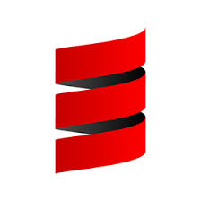
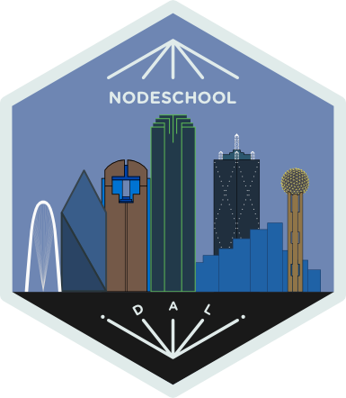
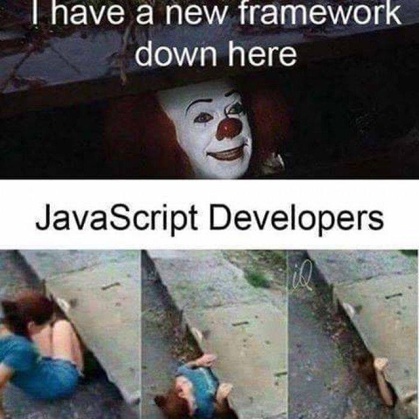
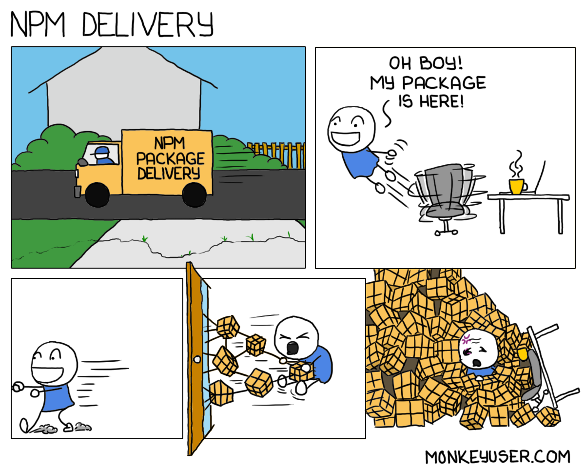
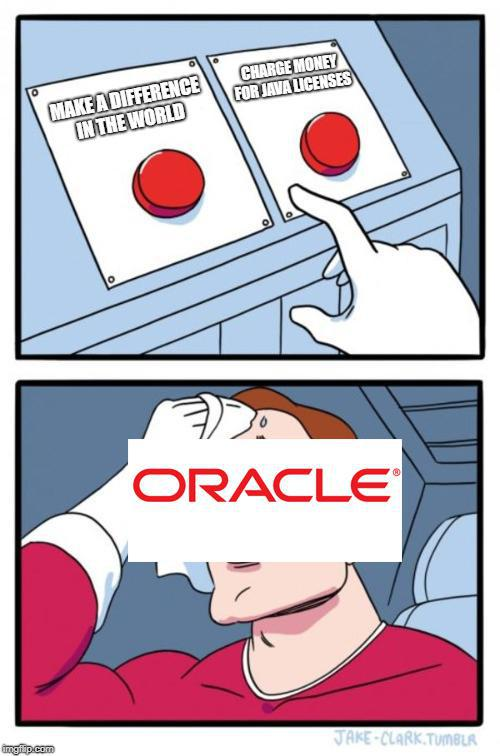

# Node.js for Java Developers
<i class="fab fa-twitter"></i>Gangstead

<!-- .element: class="foot" --> JavaMUG 10/10/2018 *slides https://gangstead.github.io/jode-for-nava*
====
# Outline
- About me
- JS a very brief history
- Node.js even briefer history
- Node.js overview
- Tooling side by side
- Why/when to use Node.js
- Why/when to avoid Node.js

====
# Bio
----
<!-- .element: class="col bio-logo" -->
<!-- .element: class="fragment col bio-logo" data-fragment-index="1" -->
<!-- .element: class="fragment col bio-logo" data-fragment-index="2" -->
<!-- .element: class="fragment col bio-logo" data-fragment-index="3" -->
<!-- .element: class="fragment col bio-logo" data-fragment-index="4" -->
----
## <!-- .element class="heading-logo" --> Code's Cool Dallas

- Hands-on coding workshops
- <!-- .element: class="fragment" data-fragment-index="1" --> Formerly Nodeschool Dallas, now Node & more
- <!-- .element: class="fragment" data-fragment-index="2" --> Started Jan 2015, 40 past events
- <!-- .element: class="fragment" data-fragment-index="3" --> [meetup.com/CodesCool-Dallas](https://www.meetup.com/CodesCool-Dallas/)

====
# JS History
----
JavaScript, like Java, right?
----
### Netscape _Mocha_<!-- .element: class="highlight" --> project
- Brendan Eich at Netscape wanted to bring _Scheme_<!-- .element: class="highlight" --> and _Self_<!-- .element: class="highlight" --> to the startup Netscape
- Netscape teamed up with Sun Microsystems to bring their *interactive TV language* to the browser
- He built _Mocha_ in May 1995. It was released in September 1995 as _LiveScript_
  - <!-- .element: class="fragment foot highlight" data-fragment-index="1" --> I mean started and finished in 10 days in May 1995
  - <!-- .element: class="fragment foot highlight" data-fragment-index="1" --> Java project started in June 1991, Java 1.0 released January 1996.
Note: Marc Andreessen, of a17z wanted a "glue language" for the browser that was easy to use and could be embedded directly in the markup.  That's why the talks with Sun pivoted from Java in the browser back to a scripting language that could "complement" Java. So Eich's planned language was given a Java-like syntax.
----
<!-- .element: class="text-left" -->
- Some excerpts about _Scheme_<!-- .element: class="highlight" -->

> ...a programming language that supports multiple paradigms, including functional programming and imperative programming,[1] and is one of the two main dialects of Lisp. Unlike Common Lisp, the other main dialect, Scheme follows a minimalist design philosophy specifying a small standard core with powerful tools for language extension...<!-- .element: class="foot" -->

- And _Self_<!-- .element: class="highlight" -->

> ... an object-oriented programming language based on the concept of prototypes. Self began as a dialect of Smalltalk, being dynamically typed and using just-in-time compilation (JIT) ...<!-- .element: class="foot" -->
----
## So why team up with <!-- .element class="heading-logo" -->?
- In one year of being released Netscape had about 75% share of browser market
- Microsoft said "that's a nice market you have there, it'd be a shame if something were to happen to it"
Note: Netscape wanted JS to be the companion language to Java like Visual Basic was to C++

----
## Standardization
- August 1996 - Microsoft included a reverse engineered `JScript` in Internet Explorer 3
- November 1996 - Netscape submits JavaScript standard to ECMA International
  - All browsers can now implement the same language, which they promptly do.  The end.
====
# Node.js history
----
Node.js history
- 2009
- google
- v8
====
# Node.js overview
====
# Tooling side by side
----
npm vs maven
----
#### Remember how _Scheme_<!-- .element: class="highlight" --> had a 'small standard core'?
----

----

----
#### And how about that JDK11 license?

----
SpringMVC vs express/hapi/some framework I read about in a blog post
====
# When to Node
----
io bound
- REST API
====
# When not to Node
----
## Computation bound
- Long math calculations

Note: Node is single threaded.  If you need to multiply some huge matrices you will be stuck in one thread
====
# The end
@Gangstead
